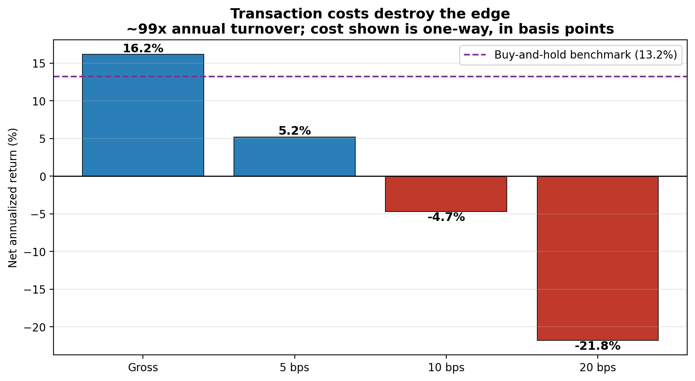

# ML-Enhanced Momentum Trading Strategy — a backtest post-mortem

**Gross 16.2% annualized** · **net-negative after realistic costs** · **~99x annual turnover** · **alpha t = 0.93 (not significant)** · *2011–2024, walk-forward, no look-ahead*

> ### The question
> **Can a machine-learning ensemble turn momentum into *tradeable* alpha — and does the edge survive the tests a gross backtest usually skips?**
>
> ### The finding
> **No — and that is the point of the project.** The gross backtest returns **16.2%/yr** (vs **13.2%** for the benchmark) and looks like a winner. But put it through the checks that actually matter and the edge evaporates: the gross "alpha" is **statistically insignificant** (Jensen α = +3.6%/yr, **t = 0.93**, β = 0.99), and the strategy reconstitutes itself **daily** — trading ~99× per year — so realistic transaction costs turn it **net-negative**. This repo is a case study in *why backtests lie*, and in the turnover, cost, and significance tests that catch it.

---

## 1. The seductive result

On paper, it looks like a winner. A \$1 stake in 2011 grows to ~\$7.6 versus ~\$5.3 for the equal-weighted benchmark — 16.2%/yr, Sharpe 0.70.


*\$1 → ~\$7.6 (strategy) vs ~\$5.3 (benchmark), +2.95%/yr raw. The lines track almost identically until ~2020, then diverge. "Looks like alpha" — hold that thought.*


*The record is **streaky** — carried by 2021 (+57%) and 2024 (+34%), while it lagged badly in 2019 and lost −19% in 2022. Lumpy outperformance is the fingerprint of a concentrated book, not a steady edge.*

This is where most momentum-ML projects stop. The rest of this README is the part that matters.

---

## 2. Does the model actually predict anything?

Sort every out-of-sample prediction into deciles and measure the **actual** forward 21-day return of each bucket:


*The edge is real but tiny and lives only at the tails: top-decile picks return **1.49%/month** vs **0.88%** for the bottom — a ~61 bp spread from a classifier whose **AUC is only ~0.51**. Deciles 1–7 are essentially noise. There is *a* signal, but it is faint.*

---

## 3. Reality check #1 — is the "alpha" even real?

Regress the strategy's excess returns on the benchmark's (Jensen's alpha, Newey-West/HAC t-stats):

| | gross | net @ 10 bps |
|---|---:|---:|
| Alpha (annualized) | +3.63% | −16.13% |
| **t-stat** | **0.93** | −4.11 |
| Beta | 0.99 | 0.99 |
| R² | 0.58 | 0.58 |

**The gross alpha is statistically insignificant** (t = 0.93, p ≈ 0.35). With β ≈ 1.0, the outperformance is indistinguishable from "more beta plus noise." There is no defensible skill claim before we even mention costs.

---

## 4. Reality check #2 — could you actually trade it?

The backtest reconstitutes the portfolio **every day** (the "weekly rebalance" in the original write-up is *not* what the code does — a finding in itself), trading **~78% of the book daily** for **~99× annual turnover**. Apply realistic per-trade costs:



| scenario | net annual return | Sharpe | max DD |
|---|---:|---:|---:|
| Gross | 16.17% | 0.70 | −31.8% |
| 5 bps (optimistic) | 5.20% | 0.25 | −42.6% |
| **10 bps (realistic)** | **−4.70%** | **−0.20** | −65.3% |
| 20 bps (conservative) | −21.80% | −1.10 | −96.8% |

At a realistic **10 bps** one-way cost the strategy **loses money** (net α = −16%/yr, t = −4.1). Even an *optimistic* 5 bps (5.2%/yr) **underperforms simply buying and holding** the universe (13.2%). The apparent edge is smaller than the cost of capturing it.

---

## The verdict

Stacking the three checks together:

1. **The signal is faint** — AUC ≈ 0.51, meaningful only at the decile extremes.
2. **The gross "alpha" is not statistically significant** — t = 0.93; it is mostly beta and concentration.
3. **It is untradeable as built** — ~99× turnover makes it net-negative at realistic costs.

The 16% gross headline is a **backtest artifact**. Surfacing that — instead of reporting the gross Sharpe and stopping — *is* the result. A strategy that survives these tests is rare; knowing how to run them is the transferable skill.

## What I would do differently

- **Cut turnover first** — rebalance weekly/monthly and add a turnover penalty / no-trade band so positions change only when the signal moves materially. The daily reconstitution is the single biggest killer.
- **Cost-aware objective** — optimize net-of-cost return, not gross.
- **Point-in-time universe** — the current universe is today's known large-caps (survivorship bias inflates the gross number).
- **Honest benchmark** — beta-matched / SPY comparison, and net-of-cost reporting from the start.

---

## How it works (methodology)

- **Universe:** ~98 large-cap U.S. equities, daily, 2010–2024.
- **Features (25):** returns, volatility, moving averages, risk-adjusted returns, distance-from-MA across 5 horizons (5–120 days).
- **Models:** ensemble of Ridge, Random Forest, XGBoost, Gradient Boosting, weighted by recent validation performance, predicting P(stock beats the universe median next month).
- **Portfolio:** long-only, top 10% by signal, signal-weighted.
- **Validation:** rolling walk-forward — train 252d, validate 63d, test 21d, step 5d, **677 windows**, retraining each step (no look-ahead).

Full derivations: [`docs/STRATEGY_REPORT.md`](docs/STRATEGY_REPORT.md) and the original paper ([`docs/ml_momentum_paper.pdf`](docs/ml_momentum_paper.pdf)), which document the *gross* analysis that motivated this post-mortem.

## Quickstart

```bash
pip install -r requirements.txt

python download_data.py          # build df_2010.csv from free Yahoo Finance data
python momentum_ml_framework.py  # backtest -> portfolio_returns.csv, portfolio_positions.csv
python make_charts.py            # gross-performance charts
python analyze_costs.py          # the reality check: turnover, net-of-cost returns, alpha significance
```

Optional out-of-sample feature/signal diagnostics: `python momentum_ml_diagnostics.py` → `outputs/`.
On Windows, `./run_overnight.ps1` runs the pipeline end to end.

## Data

The original research used **Bloomberg** price data, which is licensed and **not redistributable**, so it is intentionally **not committed**. [`download_data.py`](download_data.py) rebuilds a comparable, free dataset from Yahoo Finance for the same ~98 tickers, in the schema the loader expects:

```
date, PX_OPEN, PX_HIGH, PX_LOW, PX_LAST, VOLUME, ticker
```

Yahoo's adjustments and survivorship differ from Bloomberg's, so regenerated numbers will be close but not identical. The methodology — and the conclusion — are unchanged.

## Repository layout

```
.
├── momentum_ml_framework.py    # walk-forward backtest + performance analysis
├── momentum_ml_diagnostics.py  # out-of-sample feature / signal diagnostics
├── analyze_costs.py            # turnover, net-of-cost returns, alpha significance (the reality check)
├── make_charts.py              # render gross-performance charts
├── download_data.py            # build df_2010.csv from free Yahoo Finance data
├── run_overnight.ps1           # Windows runner: data -> diagnostics -> backtest -> charts
├── requirements.txt
├── portfolio_returns.csv       # daily strategy returns (committed result)
├── outputs/                    # diagnostic tables (csv + xlsx)
├── figures/                    # charts (CHART_1..7, strategy_performance)
└── docs/
    ├── STRATEGY_REPORT.md      # detailed methodology & gross results
    ├── ml_momentum_paper.pdf   # IEEE-format research paper (compiled)
    └── ml_momentum_paper.tex   # paper source (LaTeX)
```

## Author

**Austin Belman**

## License

[MIT](LICENSE)

## Disclaimer

Educational research project. The backtest excludes transaction costs by default — quantifying their effect is the whole point of `analyze_costs.py`. Nothing here is investment advice.
