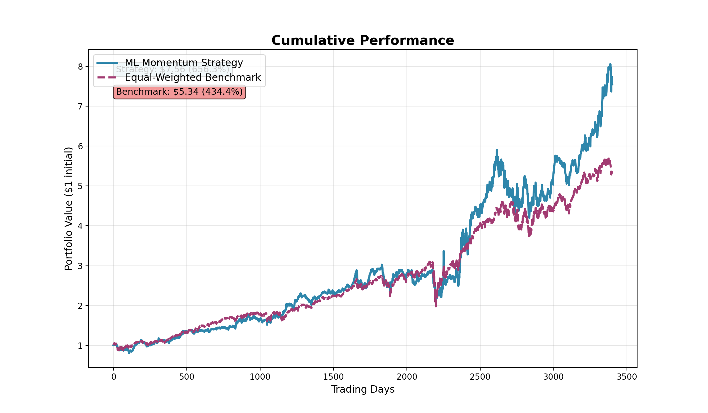
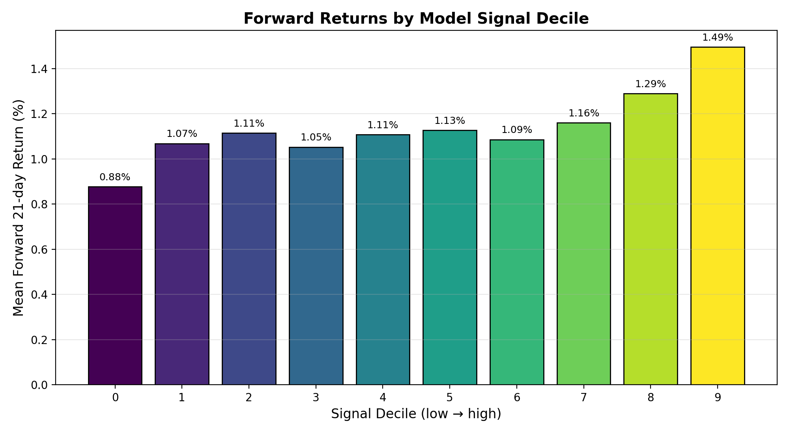
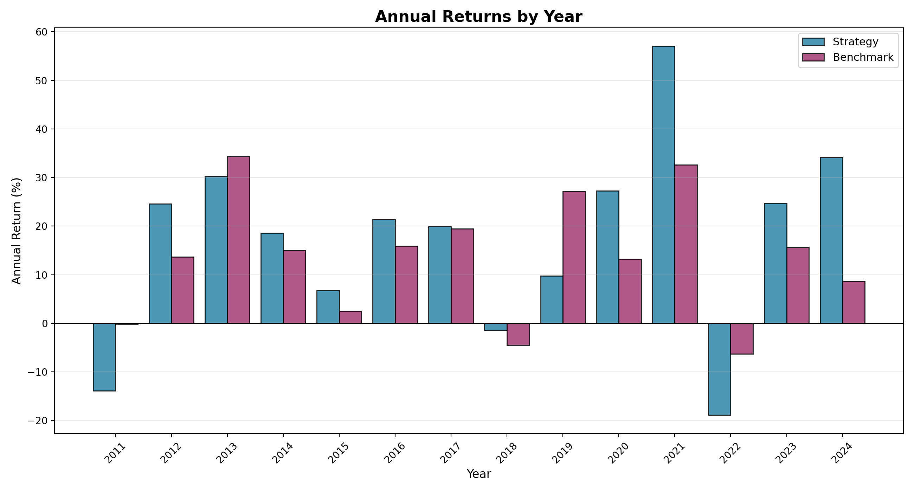
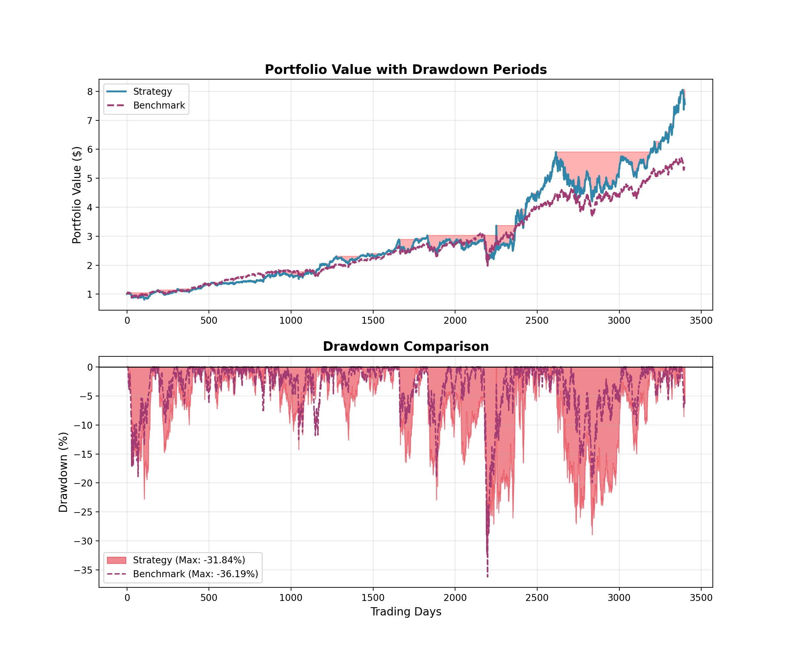

# ML-Enhanced Momentum Trading Strategy

> ### The question
> **Can a machine-learning ensemble turn classic momentum signals into market-beating returns — and if so, where does the edge actually come from?**
>
> ### The finding
> **Yes — but the *why* is the interesting part.** Over 2011–2024 the strategy returned **16.2%/yr vs 13.2%** for the benchmark (**+2.95% annual**, 656% vs 434% total), validated entirely out-of-sample with rolling walk-forward retraining. Decomposing that edge, the model's predictive power lives almost entirely at the **extremes** — its top-decile picks return **1.49%** over the next month vs **0.88%** for the bottom decile, with a flat middle — and the outperformance comes from **concentrating capital in that top decile**, not from broad forecasting skill. The headline is a *thin-but-real* signal amplified by concentration and beta. The value of this project is the framework that lets you **prove** that rather than take the headline at face value.



*\$1 invested in 2011 grows to ~\$7.6 with the strategy vs ~\$5.3 for the equal-weighted benchmark. Note the two lines track almost identically until ~2020, then diverge — a clue we come back to at the end.*

---

## The setup

Momentum — buying recent winners — is one of the most durable anomalies in finance. The hypotheses:

- **H₁:** a non-linear ML ensemble can rank stocks by future outperformance better than a single linear momentum score.
- **H₀:** the signal is noise; complex models just overfit.

| | |
|---|---|
| **Universe** | ~98 large-cap U.S. equities, daily data, 2010–2024 |
| **Features (25)** | returns, volatility, moving averages, risk-adjusted returns, distance-from-MA across 5 horizons (5–120 days) |
| **Models** | ensemble of Ridge, Random Forest, XGBoost, Gradient Boosting — weighted by recent validation performance |
| **Target** | P(stock beats the universe median over the next 21 days) |

---

## Step 1 — Does the model actually predict anything?

Before trusting any backtest, the first question is whether the signal ranks stocks *at all*. Sorting every out-of-sample prediction into deciles and measuring the **actual** forward 21-day return of each bucket:



*The edge is real but narrow. Deciles 1–7 are essentially flat (~1.1%); the model's value is at the tails — it cleanly separates the **bottom** decile (0.88%) and especially the **top** decile (1.49%). A ~61 bp/month top-vs-bottom spread from a classifier whose AUC is only ~0.51: modest, but monotonic at the extremes and exactly enough to exploit by holding the top 10%.*

This is the honest core of the result — the model is not a crystal ball, but it reliably flags the strongest and weakest names, which is all a long-only top-decile portfolio needs.

---

## Step 2 — From signal to portfolio

- **Selection:** top 10% of stocks by ensemble signal
- **Sizing:** signal-weighted — stronger predictions get more capital
- **Rebalance:** weekly (every 5 trading days)
- **Validation:** rolling walk-forward — train 252d, validate 63d, test 21d, step 5d, **677 windows**, retraining each step so every prediction is genuinely out-of-sample (no look-ahead)

---

## Step 3 — The results



*The strategy beats the benchmark in most years, but it is **streaky**: standout years (2021 **+57%**, 2024 **+34%**) carry the record, while it whiffed in 2019 (+10% vs the benchmark's +27%) and fell **−19% in 2022**. The early 2011 stretch (−14%) reflects pre-final strategy iterations. Lumpy outperformance is a hallmark of a concentrated book.*

| Metric | Strategy | Benchmark |
|---|---:|---:|
| Total return | **656.3%** | 434.3% |
| Annualized | **16.17%** | 13.22% |
| Sharpe | 0.70 | ~0.66 |
| Sortino | 0.94 | – |
| Information ratio | 0.21 | – |
| Beta | 0.995 | 1.00 |
| Volatility | 22.0% | 16.9% |
| Max drawdown | −31.8% | −36.2% |

---

## Step 4 — The cost of those returns



*No free lunch — but a useful surprise: against the equal-weighted benchmark the strategy's worst drawdown (**−31.8%**) is actually **shallower** than the benchmark's (−36.2%). The real cost shows up elsewhere — **higher volatility (22% vs 17%)** and big single-year swings (the same concentration that drove +57% in 2021 drove −19% in 2022). Tail risk is meaningful: 95% daily VaR ≈ −2.0%, CVaR ≈ −3.2% (see `figures/CHART_5_Returns_Distribution.png`).*

---

## The real finding — where do the returns come from?

This is where a disciplined backtest earns its keep. Decomposing the +2.95% outperformance:

1. **Beta does much of the work.** Beta ≈ 1.0 with volatility 22% vs 17% — the strategy is essentially a *higher-octane* version of the universe in a 13-year bull market. A meaningful slice of the "alpha" is amplified beta.
2. **The predictive edge is genuine but small** — visible only at the decile extremes (Step 1), with AUC barely above 0.51.
3. **Concentration is the engine.** Holding only the signal-weighted top 10% is what converts a thin per-stock signal into portfolio outperformance — and what makes the returns streaky.
4. **Information ratio 0.21** confirms it: the active risk taken is large relative to the alpha produced.

**Bottom line:** the ML signal is real but modest; the returns are mostly concentration plus beta. That is not a flaw to hide — surfacing it is exactly what the walk-forward framework is built to do.

---

## Limitations & next steps

- **Survivorship bias** — the universe is *today's* known large-caps; a point-in-time universe would lower returns.
- **No transaction costs** — weekly rebalancing of a concentrated book would erode the thin edge (~0.5–1%/yr).
- **Soft benchmark** — measured against an equal-weighted basket of the same names, not an investable index (SPY) or a beta-matched portfolio.
- **Natural extensions:** SPY/beta-matched benchmark, point-in-time universe, an explicit cost model, and macro features.

---

## Quickstart

```bash
pip install -r requirements.txt

python download_data.py          # build df_2010.csv from free Yahoo Finance data
python momentum_ml_framework.py  # run the backtest -> portfolio_returns.csv, strategy_performance.png
python make_charts.py            # render the charts above from the returns
```

Optional out-of-sample feature/signal diagnostics (slower): `python momentum_ml_diagnostics.py` → `outputs/`.
On Windows, `./run_overnight.ps1` runs every stage (it fetches the data first if needed).

## Data

The original research used **Bloomberg** price data, which is licensed and **not redistributable**, so it is intentionally **not committed**. [`download_data.py`](download_data.py) rebuilds a comparable, free dataset from Yahoo Finance for the same ~98 tickers, in the schema the loader expects:

```
date, PX_OPEN, PX_HIGH, PX_LOW, PX_LAST, VOLUME, ticker
```

Yahoo's adjustments and survivorship differ from Bloomberg's, so numbers regenerated from the free data will be close but **will not match the headline figures exactly**. The methodology is identical.

## Repository layout

```
.
├── momentum_ml_framework.py    # walk-forward backtest + performance analysis
├── momentum_ml_diagnostics.py  # out-of-sample feature / signal diagnostics
├── make_charts.py              # render charts from portfolio_returns.csv
├── download_data.py            # build df_2010.csv from free Yahoo Finance data
├── run_overnight.ps1           # Windows runner: data -> diagnostics -> backtest -> charts
├── requirements.txt
├── portfolio_returns.csv       # daily strategy returns (committed result)
├── outputs/                    # diagnostic tables (csv + xlsx)
├── figures/                    # generated charts (CHART_1..6, strategy_performance)
└── docs/
    ├── STRATEGY_REPORT.md      # detailed methodology & results
    ├── ml_momentum_paper.pdf   # IEEE-format research paper (compiled)
    └── ml_momentum_paper.tex   # paper source (LaTeX)
```

For the full methodology and derivations, see [`STRATEGY_REPORT.md`](docs/STRATEGY_REPORT.md) and the paper
([`ml_momentum_paper.pdf`](docs/ml_momentum_paper.pdf), LaTeX source `docs/ml_momentum_paper.tex`).

## Author

**Austin Belman**

## License

[MIT](LICENSE)

## Disclaimer

Educational research project. Backtested results exclude transaction costs, slippage, and taxes,
and are not indicative of future performance. Nothing here is investment advice.
