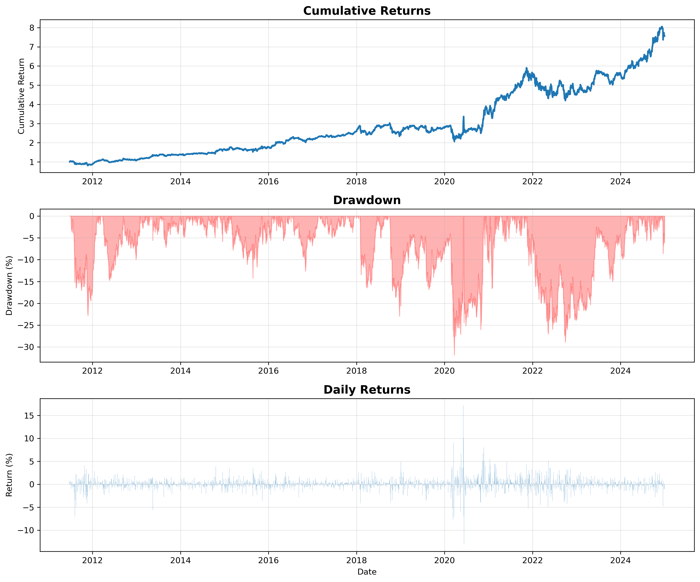

# ML-Enhanced Momentum Trading Strategy

A machine-learning momentum strategy for U.S. large-cap equities. An ensemble of
**Ridge, Random Forest, XGBoost, and Gradient Boosting** ranks stocks by their
predicted probability of outperforming the universe over the next month. A
long-only, **signal-weighted** portfolio holds the top decile and rebalances
weekly. Everything is evaluated with **rolling walk-forward validation**, so every
prediction is genuinely out-of-sample (no look-ahead bias).

> **Backtest, 2011–2024:** **16.17%** annualized return vs **13.22%** for the
> equal-weighted benchmark — **+2.95% annual alpha**, Sharpe **0.70**, max
> drawdown **−31.8%**.
> Headline figures are from the original study dataset; see [**Data**](#data).



---

## Results

| Metric           | Strategy | Benchmark | Edge       |
|------------------|---------:|----------:|-----------:|
| Total return     |  656.32% |   434.35% | +221.97%   |
| Annualized       |   16.17% |    13.22% | +2.95%     |
| Sharpe ratio     |    0.700 |      ~0.66 | +0.04     |
| Sortino ratio    |    0.935 |         – | –          |
| Max drawdown     |  −31.84% |     ~−30% | −1.84%     |
| Volatility       |   22.02% |    16.87% | +5.15%     |
| Win rate (daily) |   53.63% |         – | –          |

Charts (`CHART_1`–`CHART_5`) and a full write-up are generated by the pipeline.
Deep dives: [`STRATEGY_REPORT.md`](STRATEGY_REPORT.md) and the research paper
([`ml_momentum_paper.pdf`](ml_momentum_paper.pdf), LaTeX source `ml_momentum_paper.tex`).

---

## How it works

- **Features (25):** returns, volatility, moving averages, risk-adjusted returns,
  and distance-from-MA across 5 lookback horizons (5, 10, 20, 60, 120 days).
- **Target:** will the stock beat the cross-sectional median over the next 21 days?
- **Models:** an ensemble of Ridge, Random Forest, XGBoost, and Gradient Boosting,
  weighted by recent validation performance.
- **Portfolio:** long-only, top 10% by ensemble signal, capital allocated in
  proportion to signal strength, rebalanced every 5 trading days.
- **Validation:** rolling walk-forward — train 252d, validate 63d, test 21d,
  step 5d — retraining each step to mimic live trading.

---

## Quickstart

```bash
pip install -r requirements.txt

python download_data.py          # build df_2010.csv from free Yahoo Finance data
python momentum_ml_framework.py  # run the backtest -> portfolio_returns.csv, strategy_performance.png
python make_charts.py            # render CHART_1..5 from the returns
```

Optional (slow) out-of-sample feature/signal diagnostics:

```bash
python momentum_ml_diagnostics.py   # writes diagnostic tables to outputs/
```

On Windows you can run all stages with logging via `./run_overnight.ps1`.

The backtest parallelizes across CPU cores (one single-threaded worker per core),
so the full 2011–2024 run takes anywhere from a few minutes to ~1 hour depending
on core count. To try it quickly, restrict the date range in the
`__main__` block of `momentum_ml_framework.py` (an example slice is included).

---

## Data

The original research used **Bloomberg** price data, which is licensed and **not
redistributable**, so it is intentionally **not committed** to this repository.

[`download_data.py`](download_data.py) rebuilds a comparable, free, redistributable
dataset from Yahoo Finance for the same ~98 large-cap U.S. equities, written in the
exact schema the loader expects:

```
date, PX_OPEN, PX_HIGH, PX_LOW, PX_LAST, VOLUME, ticker
```

Because Yahoo's adjustments and survivorship differ from Bloomberg's, results
generated from the free dataset will be close but **will not match the headline
figures exactly**. The methodology is identical.

---

## Repository layout

```
momentum_ml_framework.py      # main walk-forward backtest + performance analysis
momentum_ml_diagnostics.py    # out-of-sample feature/signal diagnostics
make_charts.py                # render performance charts from portfolio_returns.csv
download_data.py              # fetch a free OHLCV dataset (df_2010.csv)
run_overnight.ps1             # Windows runner: diagnostics -> backtest -> charts
requirements.txt
STRATEGY_REPORT.md            # detailed methodology & results report
ml_momentum_paper.tex/.pdf    # IEEE-format research paper + compiled PDF
outputs/                      # diagnostic tables (csv + xlsx)
portfolio_returns.csv         # daily strategy returns (committed result)
CHART_*.png, strategy_performance.png
```

---

## Author

**Austin Belman**

## License

[MIT](LICENSE)

## Disclaimer

This is an educational research project. Backtested results do not include
transaction costs, slippage, or taxes and are not indicative of future
performance. Nothing here is investment advice.
